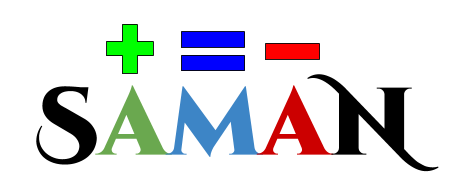

<div align="center">


## Saman

</div>

Saman(समान) is a deep object diffing and equality checker for Javascript. The library is concise consisting of only 7 functions and the distribution size is 659 bytes(Gzipped). 

#### `Example Code`
```javascript
const { diff } = require("saman");

let obj1 = {
    i:10,
    j:-3,
    y:[-1,-3]
};

let obj2 = {
    r:76,
    e:23,
    i:4,
    y:[1,2,-7]
};

console.log(diff(obj1,obj2));
```


## Installation
> Currently not published on NPM (will be soon)

### Node
```
npm i saman
```
### Browser
```
<script src="https://unpkg.com/saman"></script>
```
### Browser Optimized (gzipped)
```
<script src="https://unpkg.com/vachan/dist/browser/saman.min.js.gz"></script>
```

## Documentation
> Underconstruction

#### `saman.equal(obj1: Object, obj2: Object) -> Boolean`
This function recursively checks every property for equality of both the objects and returns a boolean.

```javascript
const { equal } = require("saman");

const obj1 = { x:10, y:20 };
const obj2 = { x:-1, y:2 };

console.log(equal(obj1,obj2)) // -> false
console.log(equal(obj1,obj1)) // -> true
console.log(equal(obj2,obj2)) // -> true
```

#### `saman.cDiff(obj1: Object, obj2: Object) -> Object`
This function recursively checks and returns every new property created in `obj2` w.r.t.`obj1` and returns an object which contains all the newly created props.

```javascript
const { cDiff } = require("saman");

const obj1 = { x:10, y:20 };
const obj2 = { x:-1, y:2, z:30 };

console.log(cDiff(obj1,obj2)) // -> { z:30 }
```

#### `saman.uDiff(obj1: Object, obj2: Object) -> Object`
...

#### `saman.dDiff(obj1: Object, obj2: Object) -> Object`
...

#### `saman.diff(obj1: Object, obj2: Object) -> Object`
...

#### `saman.diff2(obj1: Object, obj2: Object) -> Object`
...

#### `saman.merge(obj1: Object, obj2: Object) -> Object`
...